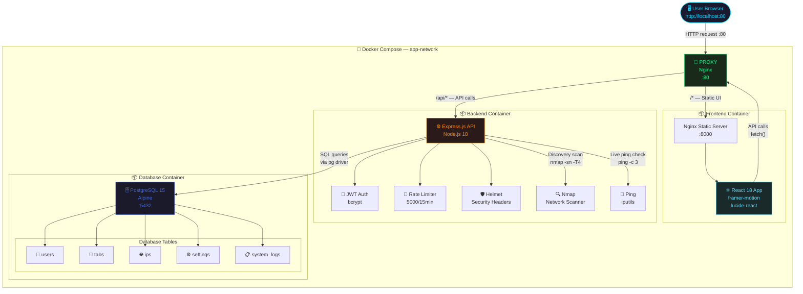

# 🏗️ IP-Manager — System Architecture Guide

> **Audience:** Non-technical stakeholders, junior developers, IT administrators.
> **Purpose:** Understand how every part of IP-Manager works, why it exists, and how data flows through the entire system.

---

## 📑 Table of Contents

1. [The Big Picture — Four Boxes, One System](#the-big-picture)
2. [The "Post Office" Analogy](#the-post-office-analogy)
3. [Architecture Diagram (Mermaid.js)](#architecture-diagram)
4. [Container Deep-Dives](#container-deep-dives)
5. [Database Deep-Dive — All 5 Tables](#database-deep-dive)
6. [How Data Flows — Step-by-Step Stories](#how-data-flows)
7. [Security Layers](#security-layers)
8. [Key Design Decisions](#key-design-decisions)

---

## 1. The Big Picture — Four Boxes, One System {#the-big-picture}

IP-Manager is made of **four independent programs** (called containers [Container: A self-contained, portable box that holds a program and everything it needs to run — like a pre-packed lunchbox]) that talk to each other over a private internal network.

```
┌─────────────────────────────────────────────────────────────┐
│                    Docker Compose Environment               │
│                    (Private Network: app-network)           │
│                                                             │
│  ┌────────────┐   ┌────────────┐   ┌────────────────────┐   │
│  │  FRONTEND  │   │  BACKEND   │   │     POSTGRES       │   │
│  │   :8080    │   │   :3000    │   │      :5432         │   │
│  │  React +   │   │  Node.js + │   │   PostgreSQL 15    │   │
│  │    Nginx   │   │   Express  │   │   (Data Storage)   │   │
│  └────────────┘   └────────────┘   └────────────────────┘   │
│         ▲               ▲                                   │
│         │               │                                   │
│  ┌──────────────────────────────┐                           │
│  │           PROXY              │ ◄── Port 80 (Public)      │
│  │    Nginx Reverse Proxy       │                           │
│  └──────────────────────────────┘                           │
└─────────────────────────────────────────────────────────────┘
```

**The outside world (your browser) can ONLY talk to the Proxy.** Everything else is hidden inside the private network. This is the first layer of security.

---

## 2. The "Post Office" Analogy {#the-post-office-analogy}

Imagine a very efficient **post office building**:

| Real World | IP-Manager Equivalent |
|---|---|
| 🏢 The building's front door | **Nginx Proxy** — the only entrance |
| 📋 The front desk receptionist | **Router** inside Nginx — directs you to the right department |
| 🖥️ The customer display screens | **React Frontend** — what you see and interact with |
| ⚙️ The sorting room workers | **Node.js Backend** — process your requests and rules |
| 🗄️ The giant filing archive | **PostgreSQL Database** — where all records live permanently |
| 🔍 The postal inspector | **Nmap** — goes out and checks which addresses are active |
| 🔑 Your identification badge | **JWT Token** — proves who you are for every request |

**Here's what happens when you search for an IP address:**

1. You type in the search box → 🖥️ The display screen captures your input
2. The screen sends a request through the front door → 🏢 Proxy receives it
3. Proxy sees it starts with `/api/` → routes it to the ⚙️ Sorting Room
4. The Sorting Room checks your badge → 🔑 Is this JWT valid?
5. Badge is valid → worker asks the 🗄️ Archive for matching records
6. Archive returns results → worker packages them → screen displays them

---

## 3. Architecture Diagram {#architecture-diagram}



---

## 4. Container Deep-Dives {#container-deep-dives}

---

### 🚦 Container 1: The Proxy

**Image:** `nginxinc/nginx-unprivileged:alpine`
**Port:** `80` (the only port exposed to the outside world)
**Role:** Traffic Police

The proxy is the **single entry point** for all traffic. It reads the URL path and decides where to send the request:

```nginx
# If the request path starts with /api → send to backend
location /api {
    proxy_pass http://backend:3000;
}

# Everything else → send to the frontend
location / {
    proxy_pass http://frontend:8080;
}

# Simple health check for Docker monitoring
location /health {
    return 200 'OK';
}
```

**Why is this important?**
- The frontend and backend never expose their ports to the internet — only the proxy does.
- This means you can place a firewall rule to only allow port 8080, and the backend database is completely unreachable from outside.

---

### ⚛️ Container 2: The Frontend

**Image:** Multi-stage build → `nginxinc/nginx-unprivileged:alpine`
**Build Tool:** `esbuild` [esbuild: An extremely fast JavaScript compiler that takes your React source code and bundles it into a single optimized file the browser can understand]
**Framework:** `React 18` with `Framer Motion` and `Lucide React`

**Build Process (Two Stages):**

```
Stage 1 (Builder):         Stage 2 (Production):
┌────────────────┐         ┌────────────────┐
│  node:18-alpine│         │  nginx:alpine  │
│  npm install   │ ──────► │  Copy /dist/*  │
│  npm run build │         │  Serve static  │
│  → /app/dist/  │         └────────────────┘
└────────────────┘
```

The multi-stage build [Multi-stage build: A Docker technique where you use a big "builder" image to compile code, then copy only the tiny output into a small "production" image — keeping the final container lean and secure] means the final container has **zero development tools** — just a tiny Nginx serving static HTML/JS/CSS files.

**Key Frontend Libraries:**

| Library | Version | What It Does |
|---|---|---|
| `react` | 18.2 | Core UI framework |
| `framer-motion` | 10.16 | Animations and smooth transitions |
| `lucide-react` | 0.294 | 500+ clean, consistent icons |
| `react-force-graph-2d` | 1.25 | Network topology visualization graph |

---

### ⚙️ Container 3: The Backend

**Image:** `node:18-alpine` + `nmap` + `iputils`
**Port:** `3000` (internal only)
**Framework:** `Express.js` [Express.js: A minimal Node.js web framework that makes it easy to create API routes — like `/api/ips` or `/api/login`]
**Role:** The application brain — all business logic lives here

**Backend Security Stack (Applied in Order):**

```
Request Arrives
      │
      ▼
  🛡️ Helmet          → Adds security headers (prevents XSS, clickjacking)
      │
      ▼
  🚦 Rate Limiter    → Blocks if > 5000 requests / 15 minutes
      │
      ▼
  📝 CORS            → Only allows trusted origins
      │
      ▼
  🔑 authenticateToken → Verifies JWT (for protected routes)
      │
      ▼
  👮 requireAdmin    → Checks if user has admin role
      │
      ▼
  📋 Route Handler   → Executes the business logic
      │
      ▼
  🗄️ PostgreSQL      → Data saved or fetched
```

**Key Backend Libraries:**

| Library | Version | What It Does |
|---|---|---|
| `express` | 4.18 | Web server and API router |
| `pg` | 8.11 | PostgreSQL driver (talks to the database) |
| `bcryptjs` | 2.4 | Password hashing |
| `jsonwebtoken` | 9.0 | Creates and validates JWT tokens |
| `helmet` | 7.0 | Security HTTP headers |
| `express-rate-limit` | 6.7 | Prevents brute-force attacks |
| `multer` | 1.4 | Handles file uploads (for backup restore) |
| `xlsx` | 0.18 | Reads/writes Excel files for import/export |
| `cors` | 2.8 | Manages Cross-Origin requests |

---

### 🗄️ Container 4: The Database

**Image:** `postgres:15-alpine`
**Port:** `5432` (internal only, never exposed outside Docker)
**Data Storage:** Docker Volume `pgdata` [Docker Volume: A special persistent storage area managed by Docker. Unlike files inside a container (which disappear when the container stops), volume data survives container restarts and upgrades]

---

## 5. Database Deep-Dive — All 5 Tables {#database-deep-dive}

The database is initialized automatically from `backend/init.sql` when the container first starts.

---

### 👤 Table: `users`

**Purpose:** Stores everyone who can log into the system.

```sql
CREATE TABLE users (
    id          SERIAL PRIMARY KEY,        -- Auto-incrementing unique ID
    username    VARCHAR(50) UNIQUE NOT NULL, -- The login name (must be unique)
    password    VARCHAR(255) NOT NULL,     -- bcrypt hash (NEVER plaintext!)
    role        VARCHAR(20) NOT NULL,      -- Either 'admin' or 'readonly'
    is_active   BOOLEAN DEFAULT TRUE,      -- Admin can disable users without deleting
    created_at  TIMESTAMP DEFAULT NOW()    -- When the account was created
);
```

**Why it matters:**
- The `password` column **never** stores the real password — only a mathematical scramble of it (bcrypt hash). Even if someone steals the database, they cannot read passwords.
- The `role` field enforces what each user can do throughout the entire application.
- `is_active` allows administrators to "soft disable" a user (prevents login) without permanently deleting their history from audit logs.
- On first startup, the backend automatically seeds one admin user: `admin / admin123`.

**Example Row:**
| id | username | password | role | is_active | created_at |
|---|---|---|---|---|---|
| 1 | admin | `$2b$10$xKh...` | admin | true | 2025-01-01 |
| 2 | john.doe | `$2b$10$ABC...` | readonly | true | 2025-03-01 |

---

### 📁 Table: `tabs`

**Purpose:** Tabs are **folders** for organizing IP addresses. Every IP can belong to one tab.

```sql
CREATE TABLE tabs (
    id               SERIAL PRIMARY KEY,
    name             VARCHAR(100) NOT NULL UNIQUE, -- The tab label (must be unique)
    is_public        BOOLEAN DEFAULT FALSE,         -- Can anonymous users see this tab?
    share_token      VARCHAR(64) UNIQUE,            -- The secret URL key for public sharing
    is_default_public BOOLEAN DEFAULT FALSE,        -- Protects the built-in "Public Sharing" tab
    created_at       TIMESTAMP DEFAULT NOW()
);
```

**Why it matters:**
- The `share_token` [Share Token: A randomly generated 48-character secret string used in a URL. Anyone with the link can view the tab — no login needed] is generated using Node.js `crypto.randomBytes(24)` — making it practically impossible to guess.
- `is_default_public` protects the built-in "Public Sharing" tab from being deleted or having sharing disabled.
- On startup, one default tab is auto-created: `Public Sharing` with a static, known token.

**Example Row:**
| id | name | is_public | share_token | is_default_public |
|---|---|---|---|---|
| 1 | Public Sharing | true | `default-public-share-token-static` | true |
| 2 | Server Room A | false | null | false |
| 3 | DMZ Network | true | `a8f3b2c1d4e5...` | false |

---

### 🌐 Table: `ips` ← The Most Important Table

**Purpose:** Stores every IP address record. This is the core of the entire application.

```sql
CREATE TABLE ips (
    id              SERIAL PRIMARY KEY,
    ip              VARCHAR(45) NOT NULL,           -- The IPv4 address (e.g., 192.168.1.100)
    hostname        VARCHAR(255),                   -- The device name (e.g., "web-server-01")
    ports           VARCHAR(255),                   -- Open ports (e.g., "80, 443, 22")
    status          VARCHAR(50) DEFAULT 'active',   -- User-defined label (e.g., "Available", "In Use")
    note            TEXT,                           -- Free-text notes
    tab_id          INTEGER REFERENCES tabs(id),    -- Which folder this IP belongs to
    created_by      VARCHAR(50),                    -- Username who added this IP
    last_updated_by VARCHAR(50),                    -- Username who last modified this IP
    subnet          VARCHAR(45) DEFAULT '',         -- Subnet mask (e.g., "255.255.255.0")
    cidr            VARCHAR(10) DEFAULT '',         -- CIDR notation (e.g., "/24")
    last_checked    TIMESTAMP,                      -- When was the last ping performed?
    last_status     VARCHAR(20),                    -- Last ping result: 'UP' or 'DOWN'
    created_at      TIMESTAMP DEFAULT NOW()
);

-- Prevents duplicate entries for the same IP within the same subnet
CREATE UNIQUE INDEX ips_unique_idx ON ips (ip, COALESCE(subnet, ''), COALESCE(cidr, ''));
```

**Why each column matters:**

| Column | Example Value | Why It Exists |
|---|---|---|
| `ip` | `192.168.1.50` | The primary identifier — the actual IP address |
| `hostname` | `printer-floor2` | Human-readable name for the device |
| `ports` | `80, 443, 22` | Useful reference for what services are running |
| `status` | `Available` | User-managed label for planning (not live status) |
| `note` | `Leased until Dec 2025` | Free-form notes for context |
| `tab_id` | `3` | Links this IP to a tab/folder |
| `created_by` | `admin` | Accountability — who added this? |
| `last_updated_by` | `john.doe` | Accountability — who last touched this? |
| `subnet` | `255.255.255.0` | Network info — allows same IP in different subnets |
| `cidr` | `/24` | Compact network notation [CIDR: Classless Inter-Domain Routing — a shorthand for network size, e.g., /24 means 254 usable addresses] |
| `last_status` | `UP` | **Live ping result** — is this device actually reachable right now? |
| `last_checked` | `2025-03-04 10:30:00` | When was the device last pinged? |

**The Unique Index — Why It's Clever:**
The same IP address (e.g., `10.0.0.1`) can legitimately exist in two different subnets. The unique index uses the combination of `ip + subnet + cidr` to prevent true duplicates while allowing the same IP across different network segments.

---

### ⚙️ Table: `settings`

**Purpose:** Stores application-wide configuration as simple key-value pairs [Key-Value: Like a dictionary — a "key" (name) maps to a "value" (data). Example: key=`ping_interval`, value=`5`].

```sql
CREATE TABLE settings (
    key   VARCHAR(50) PRIMARY KEY,  -- The setting name
    value TEXT                      -- The setting value (always stored as text)
);
```

**Default values seeded at startup:**

| key | value | Meaning |
|---|---|---|
| `ping_interval` | `3` | Auto-ping runs every 3 minutes |
| `auto_ping_enabled` | `false` | Auto-ping is OFF by default |

**Why it matters:**
- This table is intentionally simple by design. No complex schema is needed for just a handful of settings.
- The frontend reads these values from `/api/settings` and displays them in the monitoring controls. Changes are written back immediately via `PATCH` requests.

---

### 📋 Table: `system_logs`

**Purpose:** An **audit trail** [Audit Trail: A chronological record of every significant action taken in the system — like a CCTV recording for software] of every meaningful action in the application.

```sql
CREATE TABLE system_logs (
    id         SERIAL PRIMARY KEY,
    type       VARCHAR(50) NOT NULL,           -- Category of event
    message    TEXT NOT NULL,                  -- Human-readable description
    user_id    INTEGER REFERENCES users(id),   -- Who triggered this? (NULL if system)
    created_at TIMESTAMP DEFAULT NOW()
);
```

**Event Types and Examples:**

| type | Example message | Triggered by |
|---|---|---|
| `AUTH` | `User admin logged in` | Successful login |
| `AUTH` | `Failed login attempt for hacker` | Bad password |
| `IP` | `Added IP 192.168.1.50` | Admin adds IP |
| `IP` | `Updated IP 10.0.0.5` | Admin edits IP |
| `IP` | `Deleted IP 172.16.0.1` | Admin deletes IP |
| `IP_MGMT` | `Bulk imported 47 IPs` | Discovery import |
| `USER_MGMT` | `Created user john.doe` | Super admin creates user |
| `USER_MGMT` | `Disabled user ID 3` | Super admin disables account |
| `TAB` | `Created tab "Floor 2 Devices"` | Admin creates tab |
| `DISCOVERY` | `Job 1709541234 finished. Found 23 devices` | Nmap scan completes |
| `SYSTEM` | `Admin user seeded` | First-time startup |
| `PROFILE` | `Updated own password` | User changes their password |

**Why it matters:**
- Provides full accountability — you can always answer "who changed this IP record and when?"
- Security teams can detect suspicious activity (repeated failed logins, mass deletions)
- Logs are "soft-linked" to users — if a user is deleted, their log entries remain (`ON DELETE SET NULL`)

---

## 6. How Data Flows — Step-by-Step Stories {#how-data-flows}

---

### 🔐 Story 1: Logging In

```
1. User enters "admin" / "admin123" → clicks Login
2. React sends: POST /api/login  { username: "admin", password: "admin123" }
3. Nginx Proxy receives → routes to Backend (:3000)
4. Backend queries: SELECT * FROM users WHERE username = 'admin'
5. bcrypt.compare("admin123", storedHash) → ✅ Match!
6. Backend checks: is_active = true → ✅ Account enabled
7. Backend creates JWT: { id: 1, username: "admin", role: "admin" } (expires in 24h)
8. Backend logs: INSERT INTO system_logs (type='AUTH', message='User admin logged in')
9. Response: { token: "eyJ...", role: "admin", username: "admin" }
10. React stores token → routes to Dashboard
```

---

### 🔍 Story 2: Network Auto-Discovery (Nmap Scan)

```
1. Admin opens Discovery Modal → enters "192.168.1.0/24"
2. React sends: POST /api/discovery/start  { range: "192.168.1.0/24" }
3. Backend validates JWT + role = admin ✅
4. Backend generates job ID: "1709541234"
5. Backend spawns Nmap process:
   nmap -sn -T4 -n --host-timeout 30s --stats-every 5s -oG - 192.168.1.0/24
        │    │   │        │                   │           │
        │    │   │        │                   │           └─ Target range
        │    │   │        │                   └─ Report progress every 5 seconds
        │    │   │        └─ Kill if device takes >30s
        │    │   └─ Skip DNS lookups (faster)
        │    └─ Speed level 4 (fast but safe)
        └─ Ping scan only (no port scanning)

6. Backend streams Nmap output, parsing lines like:
   "Host: 192.168.1.1 ()  Status: Up" → adds to job.devices[]
   "Stats: 45.00% done" → updates job.progress = 45

7. React polls every 2s: GET /api/discovery/status/1709541234
8. React displays live results as devices are found (radar animation)

9. Nmap exits → job.status = "completed"
10. Admin clicks "Import Selected" → React sends:
    POST /api/ips/bulk  { ips: [{ ip, hostname, status }], tab_id: 2 }
11. Backend: INSERT INTO ips ... (one transaction for all selected)
12. Devices appear in the IP table, already marked as "UP"
```

---

### 📡 Story 3: Auto-Ping (Background Health Check)

```
1. Admin enables monitoring toggle → slider set to 5 minutes
2. React sends: PATCH /api/settings  { monitoring_active: true, ping_interval: 5 }
3. Backend saves: UPDATE settings SET value='true' WHERE key='auto_ping_enabled'
                  UPDATE settings SET value='5'    WHERE key='ping_interval'

4. Backend scheduler starts a setInterval loop:
   Every 5 minutes:
   a. SELECT * FROM ips (all IPs)
   b. For each IP: run ping -c 3 {ip}
   c. Parse: alive? packet_loss? latency?
   d. UPDATE ips SET last_status='UP', last_checked=NOW() WHERE id={id}

5. React dashboard shows live UP/DOWN badges updating on next fetch
```

---

### 💾 Story 4: Excel Export

```
1. User clicks "Export to Excel" (optional: with search filter applied)
2. React sends: GET /api/ips/export-excel?tab_id=2&search=server

3. Backend queries:
   SELECT i.ip, i.hostname, i.ports, i.status, i.note,
          t.name as tab_name, i.subnet, i.cidr, i.last_status,
          i.last_checked, i.last_updated_by
   FROM ips i LEFT JOIN tabs t ON i.tab_id = t.id
   WHERE i.tab_id = 2 AND (ip ILIKE '%server%' OR hostname ILIKE '%server%' ...)

4. Backend uses xlsx library to:
   a. Convert rows to JSON objects with friendly column names
   b. Create a workbook → add worksheet → write to buffer
   c. Set headers: Content-Disposition: attachment; filename=ips_export_2_1709541234.xlsx

5. Browser receives the file → automatic download starts
```

---

## 7. Security Layers {#security-layers}

IP-Manager has **defence in depth** [Defence in Depth: Multiple overlapping security measures, so that if one layer fails, others still protect the system] — multiple layers of protection:

```
Layer 1: Network Isolation
━━━━━━━━━━━━━━━━━━━━━━━━━━
• Only port 8080 is exposed outside Docker
• Database port 5432 is entirely internal
• Backend port 3000 is entirely internal

Layer 2: TLS & Headers (Helmet)
━━━━━━━━━━━━━━━━━━━━━━━━━━━━━━━
• X-Content-Type-Options: nosniff
• X-Frame-Options: DENY (prevents clickjacking)
• X-XSS-Protection: 1; mode=block
• Referrer-Policy: strict-origin-when-cross-origin

Layer 3: Rate Limiting
━━━━━━━━━━━━━━━━━━━━━━
• Max 5,000 requests per 15 minutes per IP address
• Returns HTTP 429 if exceeded

Layer 4: Authentication (JWT)
━━━━━━━━━━━━━━━━━━━━━━━━━━━━━
• Every protected route checks the Authorization header
• Token expires after 24 hours
• Secret key required to create/verify tokens

Layer 5: Authorization (Roles)
━━━━━━━━━━━━━━━━━━━━━━━━━━━━━━
• readonly users cannot call POST/PUT/DELETE routes
• admin users cannot manage other users (super-admin only)
• requireAdmin and requireSuperAdmin middleware enforced per-route

Layer 6: Password Security (bcrypt)
━━━━━━━━━━━━━━━━━━━━━━━━━━━━━━━━━━━
• Cost factor: 10 rounds (computationally expensive to crack)
• Salt is unique per password (prevents rainbow table attacks)

Layer 7: SQL Injection Prevention
━━━━━━━━━━━━━━━━━━━━━━━━━━━━━━━━━
• 100% parameterized queries: pool.query('... WHERE id = $1', [id])
• Column allow-list for dynamic ORDER BY clauses
• Input regex validation for IP addresses and CIDR notation

Layer 8: File Upload Security
━━━━━━━━━━━━━━━━━━━━━━━━━━━━━
• Uploads stored in /tmp/uploads (temporary, auto-cleaned)
• File parsed and deleted immediately after processing

Layer 9: Non-Root Containers
━━━━━━━━━━━━━━━━━━━━━━━━━━━━━
• Backend runs as appuser (not root)
• Frontend/Proxy use nginxinc/nginx-unprivileged (runs as user 101)
• Reduces blast radius if a container is compromised
```

---

## 8. Key Design Decisions {#key-design-decisions}

| Decision | What Was Chosen | Why |
|---|---|---|
| **Single `server.js` file** | All routes in one file | Simplicity over structure. No module loading errors. Easy to audit. |
| **No ORM** | Raw SQL via `pg` driver | Performance, transparency, no magic. SQL is the right tool for the job. |
| **esbuild over Webpack** | `esbuild` | 10-100x faster build times. Perfect for a single-page app without complex needs. |
| **Alpine Linux base** | `node:18-alpine`, `postgres:15-alpine` | Extremely small image size (~50MB vs ~900MB). Fewer vulnerabilities. |
| **Multi-stage Docker build** | Separate builder/production images | Production container has zero build tools — smaller + more secure. |
| **Nmap over custom ping** | System `nmap` binary via `spawn()` | Battle-tested, industry standard. Handles complex network topologies properly. |
| **JWT over sessions** | Stateless JWT | No session storage needed on the server. Scales horizontally. Simple to implement. |
| **Docker Volume for DB** | Named volume `pgdata` | Data survives container upgrades and restarts without any manual backup steps. |
| **Single Nginx proxy** | One proxy in front of both FE/BE | Cleaner architecture. One external port. Enables future SSL termination in one place. |

---

<div align="center">

---

_IP-Manager Architecture Guide — Generated March 2026_
_Built on Docker · Node.js · React · PostgreSQL · Nmap_

</div>
