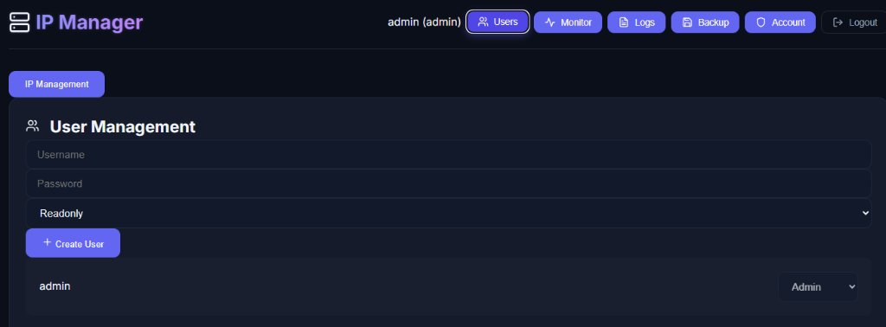

# IP Manager

A powerful and modern IP address management (IPAM) solution designed to help administrators track, visualize, and manage IP addresses across their networks. Built with a focus on performance, usability, and visualization.

## 🚀 Features

> **⚠️ Note**: This project is currently in development and **not fully stable**. Some features may not function as expected. Specifically, the **Backup & Restore** functionality for IPs is currently not working properly.

- **IP Management**: Efficiently add, edit, delete, and search IP addresses.
⚠️- **Network Visualization**: Interactive network maps using force-directed graphs to visualize connections.
- **User Management**: Secure authentication and role-based access control.
- **Data Import/Export**: Support for Excel import/export to easily migrate data.
- **Monitoring**: Real-time status monitoring of IP addresses.
- **Responsive Design**: Modern UI built with React and Framer Motion.
- **Dockerized**: Fully containerized for easy deployment and scalability.

## 📸 Screenshots

| Dashboard | User Management |
|:---:|:---:|
|  |  |

| System Logs | Monitor Settings |
|:---:|:---:|
|  |  |

<p align="center">
  
</p>

## 🛠️ Tech Stack

### Frontend
- **React**: UI library for building interactive interfaces.
- **Framer Motion**: For smooth animations and transitions.
- **Lucide React**: Beautiful and consistent icons.
- **Esbuild**: Extremely fast JavaScript bundler.

### Backend
- **Node.js & Express**: Robust and scalable backend API.
- **PostgreSQL**: Reliable relational database for data storage.
- **JWT**: Secure JSON Web Token authentication.

### Infrastructure
- **Docker & Docker Compose**: Containerization and orchestration.
- **Nginx**: High-performance reverse proxy.

## 📋 Prerequisites

Before you begin, ensure you have the following installed:
- [Docker](https://www.docker.com/get-started)
- [Docker Compose](https://docs.docker.com/compose/install/)
- [Git](https://git-scm.com/downloads)

## ⚡ Getting Started

1. **Clone the repository**
   ```bash
   git clone https://github.com/Git-Raheman/ip-manager.git
   cd ip-manager
   ```

2. **Start the application**
   Run the following command to build and start all services:
   ```bash
   docker-compose up --build -d
   ```

3. **Access the application**
   Open your browser and navigate to:
   ```
   http://localhost:8080
   ```

## 🤝 Contribution

We welcome contributions from the community! Whether it's fixing bugs, improving documentation, or adding new features, your help is appreciated.

### How to Contribute

1. **Fork the Project**
   Click the "Fork" button at the top right of this page.

2. **Create your Feature Branch**
   ```bash
   git checkout -b feature/AmazingFeature
   ```

3. **Commit your Changes**
   ```bash
   git commit -m 'Add some AmazingFeature'
   ```

4. **Push to the Branch**
   ```bash
   git push origin feature/AmazingFeature
   ```

5. **Open a Pull Request**
   Go to the original repository and open a Pull Request to the `main` branch.


