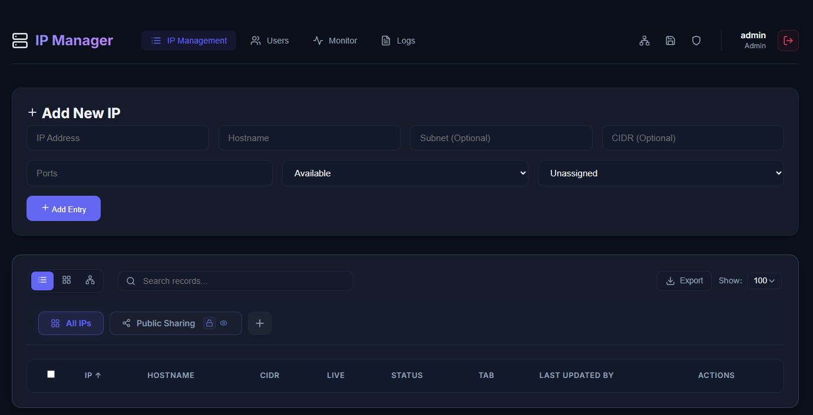
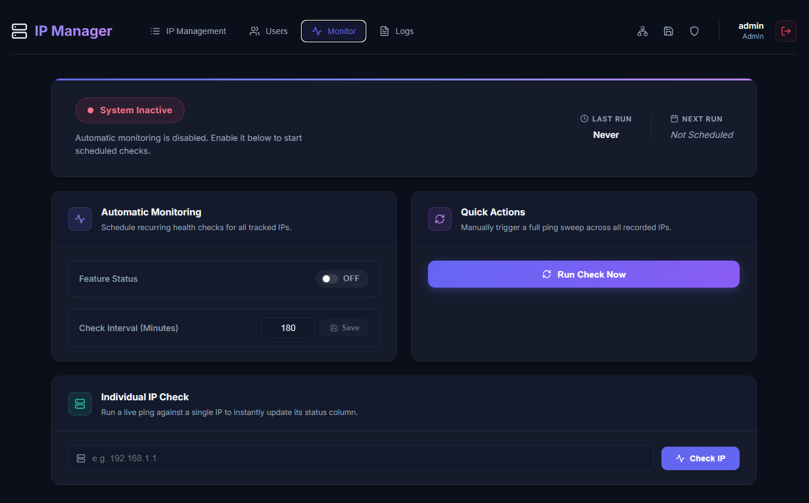
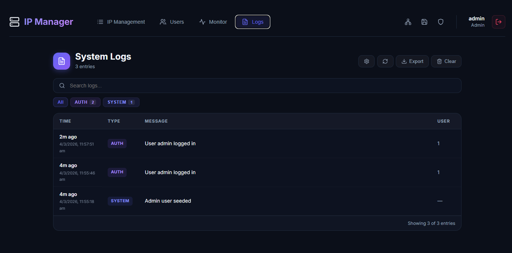

<div align="center">

# ⚡ IP-MANAGER

### _Network Intelligence. Containerized. Secured._

[](https://www.docker.com/)
[](https://nodejs.org/)
[](https://reactjs.org/)
[](https://www.postgresql.org/)
[](https://nginx.org/)
[](LICENSE)

> **A professional-grade, self-hosted IP Address Management (IPAM) system.**
> Track, ping, scan, and manage every device on your network — all from a single, beautiful dashboard.

</div>

---

## 🖼️ Screenshots

> _Launch the app with `docker compose up -d` and visit `http://localhost:80`_

### 🔐 Login Page


---

### 🖥️ IP Management Dashboard


---

### 📡 Live Network Monitor


---

### 🔭 Network Auto-Discovery


---

### 🌐 Public Shares


---

### 👥 User Management


---

### 💾 System Backup & Import


---

### 📋 System Audit Logs


---

## 🌟 Why IP-Manager?

Most network tools are either **too complex** (enterprise software costing thousands) or **too simple** (a spreadsheet). IP-Manager is the sweet spot — a powerful, self-hosted command center that any team can deploy in **under 2 minutes** using Docker.

---

## 🧱 The "Lego Bricks" Analogy — How It Works

> **Not a developer? No problem. Here's the whole system explained like Lego bricks.**

Think of IP-Manager as a **smart post office** for your network. Here's how the pieces snap together:

```
[ YOU, in your Browser ]
        │
        ▼
[ 🚦 PROXY (The Traffic Guard) ]   ← Nginx: routes requests to the right place
        │
        ├──── /api/* ──────────────► [ ⚙️  BACKEND (The Postmaster) ]
        │                                │
        │                                ├── Reads/writes data ──► [ 🗄️  DATABASE ]
        │                                └── Runs network scans ──► [ 🔍 NMAP Tool ]
        │
        └──── /* ──────────────────► [ 🎨 FRONTEND (The Display Board) ]
```

| Lego Brick | Real Name | What It Does |
|---|---|---|
| 🚦 The Traffic Guard | **Nginx Proxy** | Sits at the front door. If you ask for a webpage, it sends you to the Display Board. If you ask for data, it sends you to the Postmaster. |
| 🎨 The Display Board | **React Frontend** | Everything you SEE and CLICK. Runs in your web browser. |
| ⚙️ The Postmaster | **Node.js / Express Backend** | The brain. Processes all requests, enforces security rules, talks to the database and Nmap. |
| 🗄️ The Filing Cabinet | **PostgreSQL Database** | Permanent, safe storage for all your IP records, users, logs, and settings. |
| 🔍 The Scanner | **Nmap** | A built-in network detective. The backend uses it to automatically discover live devices on your network. |

---

## ✨ Features

### 🏠 IP Address Management
- ➕ Add, ✏️ edit, and 🗑️ delete IP records with rich metadata (hostname, ports, notes, status)
- 📁 Organize IPs into **Tabs** [Tab: A folder/category to group related IPs, like "Floor 1 Servers"]
- 🔍 Full-text search across all fields (IP, hostname, note, status, ports)
- 📊 Sort by any column with smart, numerically-correct IP ordering
- 📤 Export to Excel (`.xlsx`) with one click

### 📡 Live Network Monitoring
- **Auto-Ping** [Auto-Ping: The system automatically checks if each IP is online, on a schedule you set]
- Real-time **UP / DOWN** status badges for every device
- Manual single-IP ping with packet loss and latency (ms) results

### 🔭 Network Auto-Discovery
- Runs **Nmap** [Nmap: A free tool that scans a range of IP addresses and finds which ones have active devices] to scan an entire subnet [Subnet: A block of IP addresses, e.g., `192.168.1.0/24` covers 254 addresses]
- Live scan progress with animated radar
- One-click import of discovered devices into your database

### 🔒 Security & Access Control
- **JWT Authentication** [JWT: A digital key/pass that proves who you are, valid for 24 hours]
- Two user roles: `admin` (full access) and `readonly` (view only)
- A secret **Super Admin** account that only it can manage other users
- Password hashing with **bcrypt** [bcrypt: An algorithm that scrambles passwords so they can't be read even if someone steals the database]
- Rate limiting [Rate Limiting: Blocks anyone trying thousands of login attempts per minute]
- Security headers via **Helmet** [Helmet: A Node.js package that adds protective HTTP headers to prevent common web attacks]

### 🌐 Public Sharing
- Share read-only IP lists publicly via a unique, secure link (no login required)
- Per-tab sharing toggle — share only what you choose

### 💾 Backup & Restore
- Full JSON database backup (includes all IPs, tabs, users, settings, logs)
- One-click restore from a backup file
- Excel import/import for bulk IP management

### 📋 System Audit Logs
- Every action is recorded: logins, IP changes, user management, discoveries
- Searchable, filterable log viewer in the dashboard

---

## 🛠️ Tech Stack

| Layer | Technology | Role |
|---|---|---|
|  | **Docker & Compose** | Packages all 4 services into isolated containers |
|  | **React 18** | The UI framework — builds the interactive interface |
|  | **Framer Motion** | Smooth animations and page transitions |
|  | **Lucide React** | Clean, consistent icon library |
|  | **esbuild** | Ultra-fast JavaScript bundler [Bundler: Combines all JS files into one optimized file for the browser] |
|  | **Node.js 18 + Express** | The backend server runtime and API router |
|  | **JSON Web Tokens** | Stateless authentication system |
|  | **PostgreSQL 15** | The relational database — rock-solid data storage |
|  | **Nginx (×2)** | Frontend static file server + API reverse proxy |
|  | **Nmap** | Industry-standard network scanner |
|  | **Alpine Linux** | Tiny, secure base for all Docker images |

---

## 🚀 Quick Start

> **Prerequisites:** You only need [Docker Desktop](https://www.docker.com/products/docker-desktop/) installed. Nothing else.

### 1. Clone the Repository

```bash
git clone https://github.com/your-username/ip-manager.git
cd ip-manager
```

### 2. Launch All Services

```bash
docker compose up -d --build
```

> This command builds and starts **4 containers** simultaneously: `postgres`, `backend`, `frontend`, and `proxy`.
> The `--build` flag ensures images are freshly compiled. The `-d` flag runs everything in the background.

### 3. Open the Dashboard

```
http://localhost:80
```

### 4. Default Login Credentials

| Field | Value |
|---|---|
| Username | `admin` |
| Password | `admin123` |

> ⚠️ **Change the default password immediately after first login!**

---

## 🛑 Stopping the Application

```bash
# Stop and remove containers (data is preserved in the database volume)
docker compose down

# Stop AND delete all data (full wipe — use with caution!)
docker compose down -v
```

---

## 🗂️ Project Structure

```
ip-manager/
│
├── 📄 docker-compose.yml       ← Orchestrates all 4 services
│
├── 📁 backend/
│   ├── 🐳 Dockerfile           ← Node.js + Nmap + iputils image
│   ├── 🟢 server.js            ← All API routes (1700+ lines of power)
│   ├── 🗃️  init.sql             ← Database schema & seed data
│   └── 📦 package.json
│
├── 📁 frontend/
│   ├── 🐳 Dockerfile           ← Multi-stage: esbuild → Nginx
│   ├── 📁 src/
│   │   ├── ⚛️  App.jsx           ← Main React application (all UI)
│   │   ├── 🧩 DiscoveryModal.jsx ← Network scan modal
│   │   ├── 🎨 styles.css        ← Full custom CSS design system
│   │   └── 📄 index.html / index.jsx
│   └── 📦 package.json
│
└── 📁 proxy/
    ├── 🐳 Dockerfile           ← Nginx reverse proxy image
    └── ⚙️  nginx.conf           ← Traffic routing rules
```

---

## 🔧 Configuration

All configuration is managed through **environment variables** in `docker-compose.yml`. No config files to hunt down.

| Variable | Service | Default | Description |
|---|---|---|---|
| `POSTGRES_USER` | postgres | `user` | Database username |
| `POSTGRES_PASSWORD` | postgres | `password` | Database password |
| `POSTGRES_DB` | postgres | `ipmanager` | Database name |
| `DATABASE_URL` | backend | _(auto-set)_ | Full connection string |
| `PORT` | backend | `3000` | Internal API port |
| `JWT_SECRET` | backend | `supersecretkeychangeinproduction` | **Change this in production!** |

> ⚠️ **For production deployments**, generate a strong JWT secret:
> ```bash
> node -e "console.log(require('crypto').randomBytes(64).toString('hex'))"
> ```

---

## 🌐 API Reference

| Method | Endpoint | Access | Description |
|---|---|---|---|
| `POST` | `/api/login` | Public | Authenticate and receive a JWT token |
| `GET` | `/api/ips` | Auth | List all IPs (paginated, searchable) |
| `POST` | `/api/ips` | Admin | Add a new IP record |
| `PUT` | `/api/ips/:id` | Admin | Update an IP record |
| `DELETE` | `/api/ips/:id` | Admin | Delete an IP record |
| `POST` | `/api/ips/bulk` | Admin | Bulk import IPs |
| `POST` | `/api/ips/bulk-delete` | Admin | Bulk delete IPs |
| `GET` | `/api/ips/export-excel` | Auth | Export IPs as `.xlsx` file |
| `GET` | `/api/tabs` | Auth | List all tabs |
| `POST` | `/api/tabs` | Admin | Create a new tab |
| `DELETE` | `/api/tabs/:id` | Admin | Delete a tab |
| `POST` | `/api/ping` | Auth | Ping a single IP/hostname |
| `POST` | `/api/discovery/start` | Admin | Start an Nmap network scan |
| `GET` | `/api/discovery/status/:jobId` | Admin | Poll scan progress |
| `POST` | `/api/discovery/stop/:jobId` | Admin | Stop an active scan |
| `GET` | `/api/backup/export` | Admin | Download full JSON backup |
| `POST` | `/api/backup/import` | Admin | Restore from JSON backup |
| `GET` | `/api/logs` | Admin | View system audit logs |
| `GET` | `/api/public/tab/:token` | **None** | View a public shared IP list |

---

## 👥 User Roles

| Role | Login | View IPs | Add/Edit/Delete | Manage Users | Backup/Restore |
|---|---|---|---|---|---|
| `superadmin` (username: `admin`) | ✅ | ✅ | ✅ | ✅ | ✅ |
| `admin` | ✅ | ✅ | ✅ | ❌ | ✅ |
| `readonly` | ✅ | ✅ | ❌ | ❌ | ❌ |
| `Public (no login)` | — | Shared tabs only | ❌ | ❌ | ❌ |

---

## 🔒 Security Features

- 🛡️ **Helmet.js** — Sets HTTP security headers (XSS protection, content-type enforcement, etc.)
- 🔑 **bcrypt** — Passwords stored as salted hashes. Never in plain text.
- 🎫 **JWT (24h expiry)** — Stateless sessions. No cookies to steal.
- 🚦 **Rate Limiting** — Max 5,000 requests per 15 minutes per IP
- 🚫 **Non-root containers** — All Docker containers run as unprivileged users
- ✅ **SQL Injection Prevention** — All database queries use parameterized statements
- 🌐 **CORS** — Cross-Origin Resource Sharing properly configured

---

## 🤝 Contributing

1. Fork the repository
2. Create a feature branch: `git checkout -b feature/amazing-feature`
3. Commit your changes: `git commit -m 'Add amazing feature'`
4. Push to the branch: `git push origin feature/amazing-feature`
5. Open a Pull Request

---

## 📜 License

This project is licensed under the **MIT License** — see the [LICENSE](LICENSE) file for details.

---

<div align="center">

**Built with ❤️ for network engineers, IT admins, and anyone who loves clean data.**

⭐ _If this tool helps you, star the repo!_ ⭐

</div>
