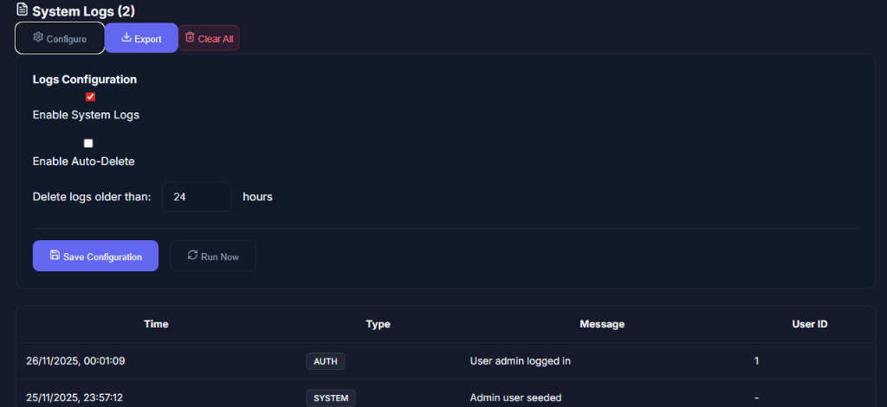
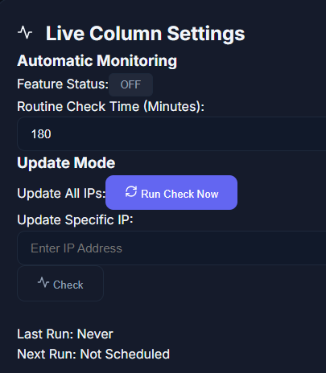

# IP Manager (Multi-User Edition)

> ⚠️ **NOTICE: THIS APPLICATION IS CURRENTLY IN BETA AND IS NOT STABLE.**
> 
> 🛑 **CRITICAL WARNING:** DATA LOSS IS POSSIBLE. **YOU MUST BACKUP YOUR DOCKER VOLUMES REGULARLY.**

## Overview

This version of **IP Manager** is designed for teams and organizations necessitating granular access control and accountability. It features a complete multi-user system with Admin and Standard User roles, alongside a comprehensive logging system to track all changes.

## ✨ Key Features

*   **Multi-User Authentication**: Secure login with role-based access control (Admin vs User).
*   **User Management**: Admins can manage users, reset passwords, and control access.
*   **Activity Logging**: Detailed logs of who did what and when (IP additions, updates, deletions).
*   **IP Management**: Centralized IP address tracking and management.
*   **System Monitoring**: Real-time server and network status checks.
*   **Backup & Restore**: Full database backup capabilities.

## 📸 Screenshots

| Dashboard | User Management |
|:---:|:---:|
|  |  |

| Activity Logs | Monitor Checks |
|:---:|:---:|
|  |  |

## 🚀 Getting Started

### Prerequisites
*   Docker & Docker Compose

### Installation

1.  Navigate to the directory:
    ```bash
    cd multi_user_bassed
    ```
2.  Start the application:
    ```bash
    docker-compose up -d --build
    ```
3.  Access the UI at `http://localhost:8080`.

## ⚙️ Configuration

Check `docker-compose.yml` for environment variables. Default database credentials:
*   User: `user`
*   Password: `password`

## 🛡️ Backup Guide

To prevent data loss, regularly backup the `pgdata` volume. Example command:

```bash
docker run --rm -v multi_user_bassed_pgdata:/volume -v $(pwd):/backup alpine tar -czf /backup/db_backup.tar.gz -C /volume ./
```
