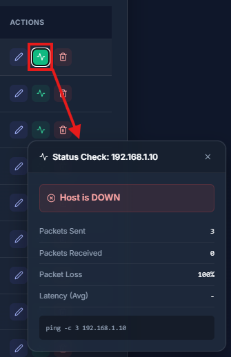
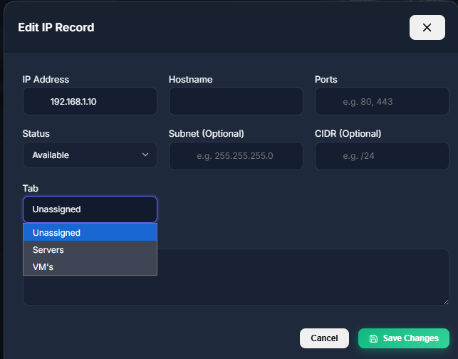

# IP Manager (Single User)

> ⚠️ **NOTICE: THIS APPLICATION IS CURRENTLY IN BETA AND IS NOT STABLE.**
> 
> 🛑 **CRITICAL WARNING:** DATA LOSS IS POSSIBLE. **YOU MUST BACKUP YOUR DOCKER VOLUMES REGULARLY.**

## Overview

IP Manager is a robust, Dockerized application designed for efficient IP address management and system monitoring. Built for single-user environments, it provides a streamlined interface for tracking IP allocations, monitoring network status, and managing system backups.

## ✨ Key Features

*   **IP Management**: Easily add, update, and manage IP records.
*   **System Monitoring**: Real-time monitoring of system resources and network status.
*   **Status Checks**: automated checks to ensure network reliability.
*   **Backup & Restore**: Built-in functionality for data backup and importing.
*   **Secure Authentication**: Single-user secure login protection.

## 📸 Screenshots

| Login | Dashboard |
|:---:|:---:|
|  |  |

| Monitoring | Status Checks |
|:---:|:---:|
|  |  |

| IP Management | Backup & Settings |
|:---:|:---:|
|  |  |

## 🚀 Getting Started

### Prerequisites

*   Docker
*   Docker Compose

### Installation

1.  Clone the repository and navigate to the `single_user_based` directory.
2.  Start the application using Docker Compose:

```bash
docker-compose up -d --build
```

3.  Access the application at `http://localhost:8080`.

## ⚙️ Configuration

The application is pre-configured with the following default credentials (change these in `docker-compose.yml` for security):

*   **Database User**: `user`
*   **Database Password**: `password`
*   **Database Name**: `ipmanager`

## 🛡️ Backup Guide

To prevent data loss, manually backup the `pgdata` volume:

1.  Identify the volume name: `docker volume ls`
2.  Create a backup:

```bash
docker run --rm -v single_user_based_pgdata:/volume -v $(pwd):/backup alpine tar -czf /backup/db_backup.tar.gz -C /volume ./
```

*(Note: Replace `single_user_based_pgdata` with your actual volume name)*
